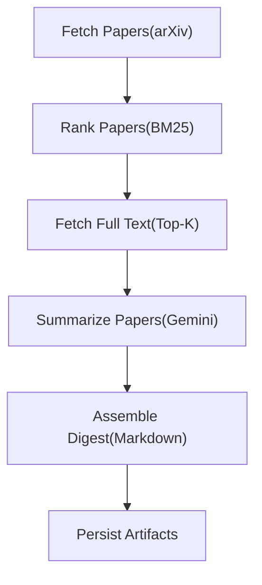

## AI-Digest-Paper
An AI-powered research assistant that automatically fetches, ranks, and summarizes newly published research papers (e.g., from arXiv) using a LangGraph-based pipeline and a Gemini-backed LLM summarizer.

The system is exposed as a FastAPI service, supports on-demand and scheduled execution, and is designed to be cloud-deployable with containerization and external storage.


## Features

🔍 Fetches newly published papers from arXiv

📊 Ranks papers using BM25

🧠 Generates structured summaries using Gemini API

🧩 Multi-stage LangGraph pipeline

🚀 Async API execution with run tracking

🗂 Artifact persistence (prompts, raw outputs, parsed JSON, digests)

🐳 Docker-ready & cloud-friendly architecture(In progress)


## 📁 Project Structure

- AI-Digest-Paper/
  - README.md
  - pyproject.toml
  - uv.lock
  - outputs/
    - digest_YYYY-MM-DD.md
    - summaries/
      - 01_<paper>_prompt.txt
      - 01_<paper>_raw.txt
      - 01_<paper>_parsed.json
  - src/
    - paper_digest/
      - __init__.py
      - config.py
      - api/
        - app.py            # FastAPI entrypoint
        - models.py         # Request / response schemas
        - runner.py         # Background LangGraph runner
        - run_store.py      # Run state storage
      - graph/
        - build_graph.py    # Graph assembly
        - state.py          # GraphState definitions
        - nodes/
          - fetch.py                # arXiv fetch
          - rank.py                 # BM25 ranking
          - fetch_full_text_topk.py # Full-text extraction
          - summarize.py            # Gemini summarization
          - assemble.py             # Digest assembly


# Installation
1. Clone the repo 
`git clone https://github.com/your-username/AI-Digest-Paper.git`
`cd AI-Digest-Paper`

2. Create and activate a virtual environment

```sh
MacOs/Linux
python -m venv .venv
source .venv/bin/activate
```
```sh
Windows(Powershell)
python -m venv .venv
.\.venv\Scripts\activate
```

3. Install Dependencies 
```sh
pip install uv / Homebrew install uv 
uv sync
```

4. LLM API Key Setup(Gemini)
Create a .env file at the project root:
```sh
GEMINI_API_KEY=your_real_api_key_here
```
The app automatically loads this via python-dotenv.
Verify API key is loaded
```sh
python -c "from paper_digest.config import get_gemini_api_key; print(get_gemini_api_key())"
```

5. Running the API locally
```sh
python -m uvicorn paper_digest.api.app:app --app-dir src --reload
```
Use `localhost/docs` to get all the endpoint infomation


# LangGraph Pipeline



# Output Artifacts
For each run, the system generates:
  - outputs/
    - digest_YYYY-MM-DD.md
    - summaries/
      - 01_<paper>_prompt.txt
      - 01_<paper>_raw.txt
      - 01_<paper>_parsed.json


## Project Status & Known Limitations

This project is **actively under development** and represents a working but evolving system.

### ✅ Current Capabilities
- End-to-end **LangGraph pipeline** (fetch → rank → summarize → assemble)
- **Asynchronous FastAPI** execution with run tracking
- **Local artifact persistence** (prompts, raw outputs, parsed summaries, digests)
- **Gemini-based structured summarization** with JSON schema enforcement

### 🚧 In Progress / Planned Enhancements
- **Persistent storage**: currently in-memory; **S3 / DynamoDB** integration planned
- **Authentication**: API is unsecured; intended for personal use at this stage
- **Scheduling**: daily automated digests via **EventBridge** not yet wired
- **Email delivery**: **SES-ready** design, not yet implemented
- **Scalability**: single-process execution; no worker pool or task queue yet
- **Ranking quality**: BM25 implemented; tuning and evaluation ongoing

### ⚠️ Disclaimer
This repository reflects an **engineering prototype and portfolio project**, not a production-ready system.  
Design choices intentionally prioritize **clarity, extensibility, and experimentation** over full operational hardening.
